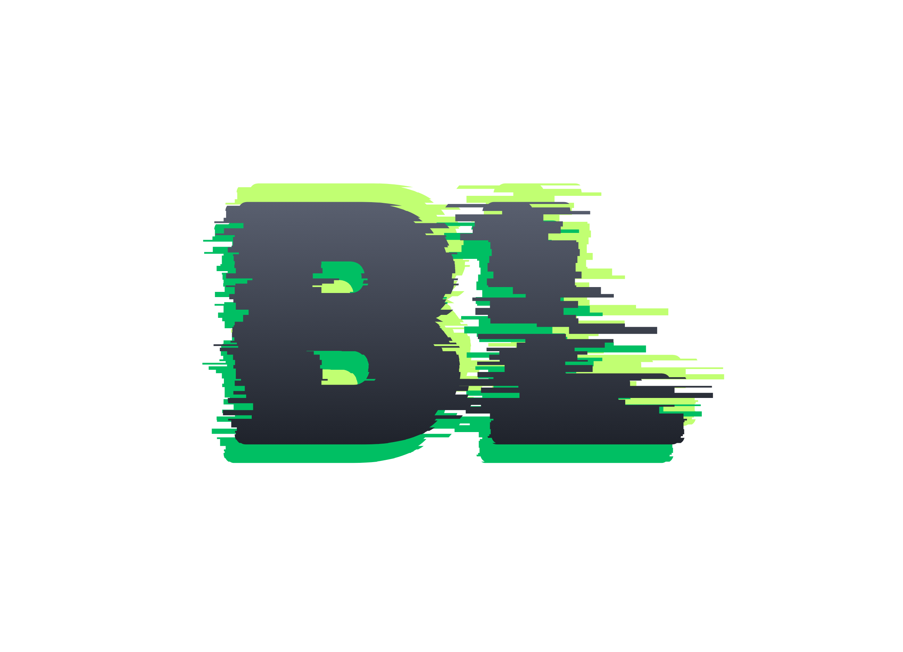

<div align="center">
  

  # ⚡ BoyutLand 🔮
  **1 Image In. Every Dimension Out. 0% Server Leaks 🛡️**

  <p align="center">
    <a href="https://hllbrayd.github.io/BoyutLand/"></a>
    <a href="LICENSE"></a>
    
  </p>
</div>

---

### ⚔️ Why It Wins

| 🛑 Typical Resizers | ⚡ BoyutLand Engine |
| :--- | :--- |
| ☁️ Uploads data to cloud servers | 🛡️ **100% in-browser RAM** (Zero server interaction) |
| 🪓 Downscales into blurry pixels | 💎 **Step-Down Scaling** for crisp icons & favicons |
| 🐌 Sluggish queues & paywalls | ⚡ **Instant HTML5 Canvas** + completely free |
| 📂 Random output filenames | 🏷️ Auto-named `.zip` (`Platform_Format_WxH.png`) |

---

### 🗂️ Presets

| Category | Formats Included |
| :--- | :--- |
| 📱 **Social Media** | Instagram, X, YouTube, TikTok, LinkedIn |
| 📲 **Flagships** | iPhone 15 Pro Max, Galaxy S24 Ultra, Galaxy A35/A25, Honor 200 |
| 💻 **Web & Ads** | Favicon (16x16/32x32), Google Ads (Leaderboard, Half Page, Square) |
| 🖨️ **Print (300 DPI)** | Biometric ID, Passport Photos, A3, A4, A5, Poster Formats |
| 🛠️ **Custom** | Manual width & height input on the fly |

---

### 🌟 Key Highlights

* 🛡️ **Local & Air-Gapped:** Photos never leave your device.
* 💎 **Step-Down Scaler:** Progressive downsampling prevents pixelation on tiny canvases.
* ✂️ **Boundary-Locked Crop:** Viewfinder stays strictly constrained inside the image frame.
* ⚠️ **Smart Warnings:** Dynamic tooltips pop up over high-distortion aspect ratios.
* 🌍 **15 Languages:** Dynamic UI switching with full Arabic RTL support.

---

### 🎮 How to Use

1. **Drop:** Drag your image into the dropzone.
2. **Select:** Pick platforms, devices, or print sizes.
3. **Download:** Grab your sorted, pre-named ZIP bundle instantly.

---

### 🧰 Tech Stack

* **Core:** Vanilla JS (ES6+), HTML5 Canvas API
* **Libraries:** `Cropper.js`, `JSZip`
* **UI:** Responsive CSS with animated purple-green gradients
* **Hosting:** GitHub Pages

---

<div align="center">
  <sub>Built by <b><a href="https://github.com/hllbrayd">hllbrayd</a></b> • Distributed under the <b>MIT License</b>.</sub>
</div>


1. **Drop:** Drag your photo directly onto the interface.
2. **Select:** Pick presets across social channels, screen resolutions, and print templates.
3. **Download:** Grab a clean, pre-bundled ZIP containing every size sorted and named.

> **Clean Filename Scheme:**  
> Files follow a consistent naming convention: `Platform_Format_WidthxHeight.png` (e.g., `Instagram_Story_1080x1920.png`).

---

### Tech Stack

* **Language:** Vanilla JavaScript (ES6+), HTML5 Canvas API
* **Styling:** Modern CSS with fluid purple-green `@keyframes` accent gradients
* **Libraries:** `Cropper.js` (constrained viewfinder) & `JSZip` (local zip packaging)
* **Hosting:** GitHub Pages

---

<div align="center">
  <sub>Authored by <b><a href="https://github.com/hllbrayd">hllbrayd</a></b> • Released under the permissive <b>MIT License</b>.</sub>
</div>


  

  # BoyutLand
  **Batch image resizing right inside your browser. No servers, zero data leaks.**

  [](https://hllbrayd.github.io/BoyutLand/)
  [](https://hllbrayd.github.io/BoyutLand/)
  [](LICENSE)
  [](https://hllbrayd.github.io/BoyutLand/)

</div>

---

### Why It Exists

Most online photo resizers quietly upload your personal pictures to remote cloud storage before handing them back. 

**BoyutLand takes a different route:** your device does every ounce of the heavy lifting.

```text
[ Your Image ] ──> ( HTML5 Canvas Engine ) ──> [ Step-Down Scaler ] ──> [ Formatted .ZIP ]
                          │
                          └──> 0 bytes ever transmitted over the network.
```

---

### Core Highlights

* **100% Client-Side Engine:** Everything runs through local memory and native browser canvas. Zero uploads, zero backends, absolute privacy.
* **Step-Down Scaling (Anti-Aliasing):** Downsizing a 4K image down to a 16x16 Favicon or an Apple Watch frame usually degrades into a pixelated mess. Our progressive scaling algorithm steps the resolution down incrementally to keep edges sharp.
* **Strict Boundary Cropping:** Visual crop overlays stay locked inside the photo frame. No jumping off-screen or vanishing during quick swipes.
* **Proactive Aspect Warnings:** Trying to force a wide landscape picture into a narrow Google Leaderboard banner? An unobtrusive tooltip alerts you immediately above that exact preset so you can adjust crop boundaries manually.
* **Comprehensive Presets:** Social media assets, 300 DPI print ratios, and exact device viewports (from iPhone 15 Pro Max to Galaxy S24 Ultra and Honor 200).
* **Multi-Language Architecture:** 15 supported languages—complete with RTL layouts for Arabic—switch instantly without page reloads.

---

### The 3-Step Flow

1. **Drop:** Drag your photo directly onto the interface.
2. **Select:** Pick presets across social channels, screen resolutions, and print templates.
3. **Download:** Grab a clean, pre-bundled ZIP containing every size sorted and named.

> **Clean Filename Scheme:**  
> Files follow a consistent naming convention: `Platform_Format_WidthxHeight.png` (e.g., `Instagram_Story_1080x1920.png`).

---

### Tech Stack

* **Language:** Vanilla JavaScript (ES6+), HTML5 Canvas API
* **Styling:** Modern CSS with fluid purple-green `@keyframes` accent gradients
* **Libraries:** `Cropper.js` (constrained viewfinder) & `JSZip` (local zip packaging)
* **Hosting:** GitHub Pages

---

<div align="center">
  <sub>Authored by <b><a href="https://github.com/hllbrayd">hllbrayd</a></b> • Released under the permissive <b>MIT License</b>.</sub>
</div>

